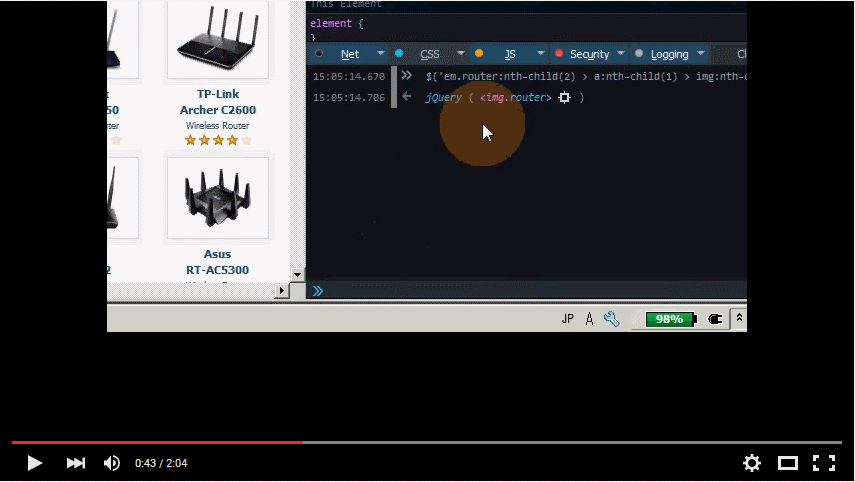
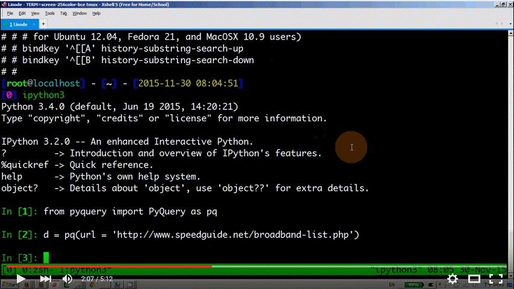

# SpeedGuide Harvest
Harvest Router information on SpeedGuide

## How to use Firefox Inspector Tool to get Unique CSS Selector and CSS Selectors of all Items 

[](https://www.youtube.com/watch?v=IetlknUBivs "How to use Firefox Inspector Tool to get Unique CSS Selector and CSS Selectors of all Items ")

- Step 1. pressing "Ctrl-Shift-I" to open "Inspector Tool" in Firefox.
- Step 2. click "Pick an element from the page" (top-left corner of the inspector pane)
- Step 3. click on the item you want to enumerate
- Step 4. on the right most of the CSS Pane, right click, then select "Copy Unique CSS Selector"
- Step 5. on the Web Console, paste the CSS Selector
- Step 6. use JQuery "$('css-selector')" to examine whether the element shows in the web console output (if it is inside an IFRAME, the web element won't show)
- Step 7. because we want to enumerate all of the items, we check the parent element's tag name and class ('em.router'), we insert the parent's CSS before the item.


## Introduction to: xShell, tmux, ipython3, PyQuery, html2text 
[](https://www.youtube.com/watch?v=LjRAGi7c1wM "How to use xShell, tmux, ipython3, PyQuery, html2text")

1. Use [xShell](https://www.netsarang.com/xshell_download.html) as your SSH Client, it is better than Putty because the text selection is smarter.
2. use [tmux](http://packages.ubuntu.com/trusty/tmux) when you log on to a Linux server/VPS. The benefits of using tmux is that you can restore your session anytime. Don't worry network disconnected unexpectedly.
  * when entering the tmux, the bottom line will be green
  * press "Ctrl-b ?" to show the [shortcut keys](https://gist.github.com/MohamedAlaa/2961058) list, press 'q' to quit
  * press "Ctrl-b w" to select tmux window, press up/down arrow to select
  * press "Ctrl-b c" to create new tmux window
3. use [ipython3](http://packages.ubuntu.com/trusty/python/ipython3) (ipython) as your interactive python shell, because it supports tab auto-completion, magic history.
4. use [PyQuery](https://pypi.python.org/pypi/pyquery) as the JQuery on the python, use PyQuery to test CSS Selectors. The usage of PyQuery is very similar to JQuery.
5. use [lxml](http://packages.ubuntu.com/trusty/python3-lxml) etree to convert PyQuery HTML Element to HTML source.
6. use [html2text](https://pypi.python.org/pypi/html2text) to convert html to markdown text. The benefits of markdown is that you can preserve URL link or image, without the hassle of HTML tags.

## website tree hiearchy

[speedguide tree hierarchy](speedguide_tree_hierarchy.png)


The tree trail can be denoted as `[1,0]`, `[1,3]` for the leaf node.

## Continuation / Resume harvesting

The harvesting spends many hours. You don't want to start over again if you encounter an error when progress is almost 99% .

### Continue from page=36, routerItem=0
- Option `-u` meaning no buffering, directly write to stdout.
- Option `-m ipdb` meaning started with interactive python debugger (needs pip install)
- Unix `tee` will write output to console and file 'log\_speedguide\_table.txt'
```sh
python3 -u -m ipdb speedguide_table.py 36 | tee --append log_speedguide_table.txt 2>&1
```

### Continue from page=58, routerItem=13
```sh
python3 -u -m ipdb speedguide_table.py 58, 13
```

